.. Brainstorm_ArtifactScanTool documentation master file, created by
   sphinx-quickstart on Tue Oct 27 15:23:31 2020.
   You can adapt this file completely to your liking, but it should at least
   contain the root `toctree` directive.

Welcome to Brainstorm_ArtifactScanTool's documentation!
=======================================================
.. toctree::
   :maxdepth: 3
   :caption: Contents:

Features
--------

- Complete Integration with `Brainstorm <https://neuroimage.usc.edu/brainstorm/Introduction/>`_
- Semi-automated exclusion of artifactual channels and epochs (i.e. trials or data blocks)
- Heatmap and histogram plotting
- Statical and Manual exclusions

Getting Started
--------

Call Tool
""""""""
Call the tool from the Matlab command-line

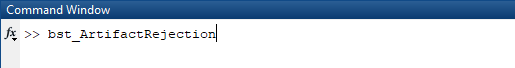

Data Input
""""""""
Select the subject directories within Brainstorm Database

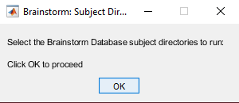
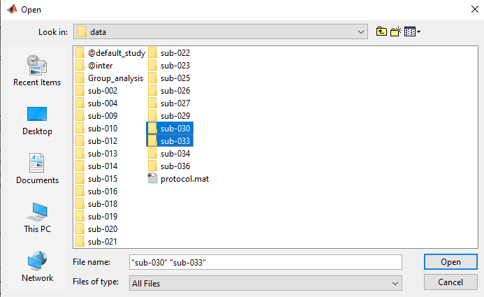

Data Type
""""""""
Select the type of data you're working with: typically blocks with resting state and trials for task-based data

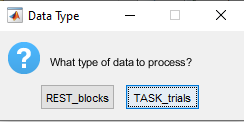

Log Output
""""""""
Select a directory where you'd like the compiled ArtifactScanTool log to be placed

.. image:: ims/step005.PNG
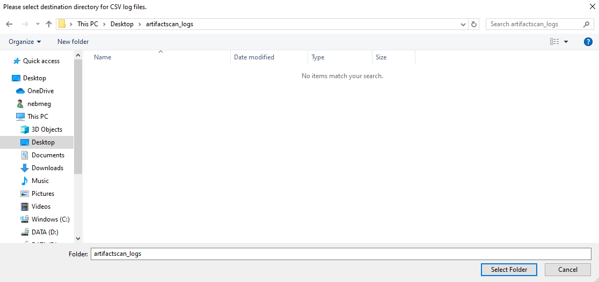

Artifact Calculation
""""""""
Data will load, and Artifact measures (amplitude and gradient) will be calculated...

.. image:: ims/step007.PNG
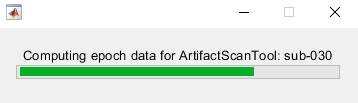

Channel Exclusion Method
""""""""
You will then be prompted to select a central tendency method to remove channels/sensors

Options

1. Mean

2. Median

3. Manual

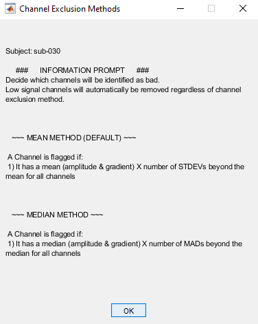

Sensor Layout
""""""""
A topoplot with gradiometer sensor locations will appear.

Note - Currently only Elekta MEGIN gradiometers are plotted. Future releases will include checks for sensor layouts.

.. image:: ims/step010.PNG

Channel Exclusion Deviation Threshold
""""""""
Now enter a deviation cutoff to be applied. This will be standard deviation if "Mean" was selected, or median absolute deviation if "Median" was selected.

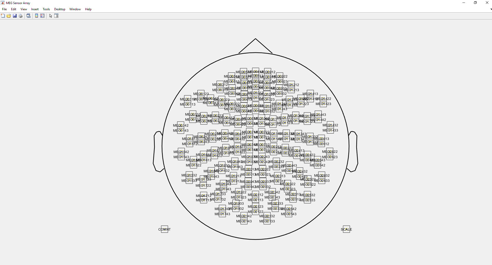

Channel Exlcusion Plotting
""""""""
Three figures will popup; one amplitude, one gradient, and one progress report.

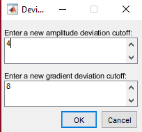
.. image:: ims/step013.PNG
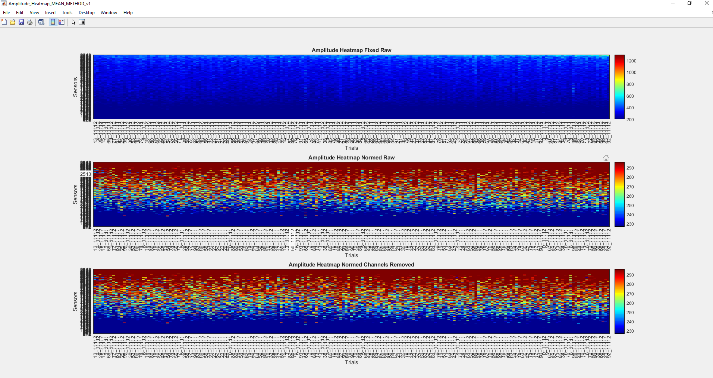

Amplitude and Gradient figures will each contain three subplots

1. Top subplot - fixed color thresholds, no bad channels marked

2. Middle subplot - color thresholds normalized to the active subject, no bad channels marked

3. Bottom subplot - color thresholds normalized to the activee subject, bad channels marked (with max colorbar color value)

Progress Report figure will contain

1. The subject identifier

2. Which channel exclusion method was selected

3. Deviation cutoff values

4. A table with specific channel labels and the flag indication (i.e. amplitude, low signal, gradient)

Note - channels with a low signal 10% or more of data blocks/trials will be automatically marked for removal

Channel Adjustment Decision
""""""""
Determine whether you'd like to change channel exclusion method or adjust thresholds, or continue to trial exclusion

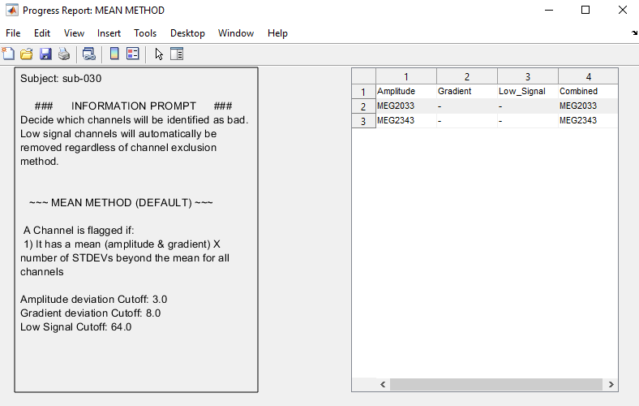

Trial Exclusion Method
""""""""
You will then be prompted to select a central tendency method to remove data blocks/trials

Options

1. Auto

2. Manual

.. image:: ims/step016.PNG
.. image:: ims/step017.PNG

Trial Exclusion Deviation Threshold
""""""""
Now enter a deviation cutoff to be applied. This will median absolute deviation, because trial exlcusion used median for central tendency to best fit tails of distribution.

.. image:: ims/step018.PNG

Trial Exclusion Plotting
""""""""
Four figures will popup; one amplitude, one gradient, and one progress report.

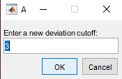
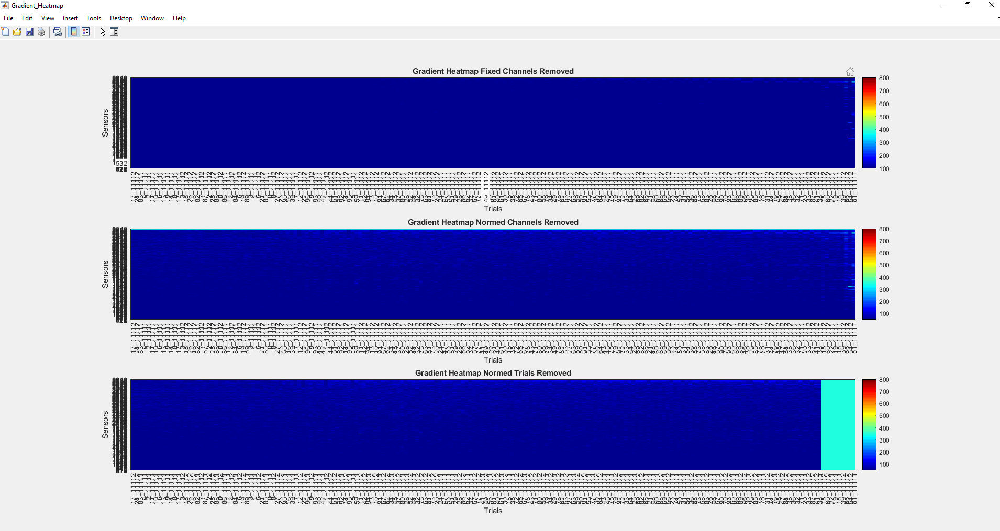
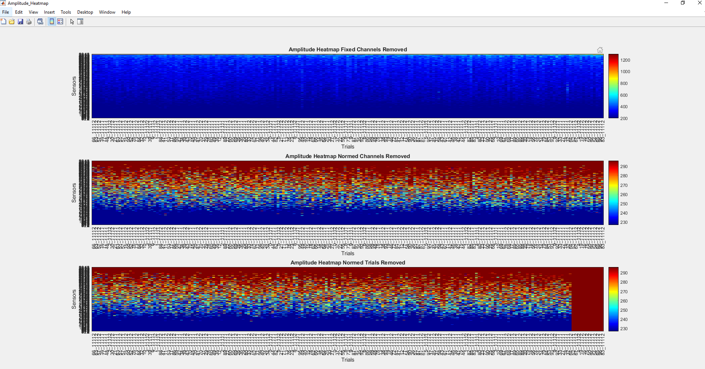

Amplitude and Gradient figures will each contain three subplots

1. Top subplot - fixed color thresholds, bad channels marked and no bad trials marked

2. Middle subplot - color thresholds normalized to the active subject, bad channels marked and no bad trials marked

3. Bottom subplot - color thresholds normalized to the activee subject, bad channels marked and bad trials marked (with max colorbar color value)

Trial distribution figure will contain

1. Histogram of amplitude values for each trial

2. Historgram of gradient values for each trial

Note - These values are estimated based on the matrix with bad channels removed (i.e. bad channel data are not included in these plots)

Progress Report figure will contain

1. The subject identifier

2. Deviation cutoff values

3. Amplitude and gradient threshold values

4. A table with specific counts (pre and post thresholding) for data blocks/trials. If there are multiple conditions, all will be listed

Trial Adjustment Decision
""""""""
Determine whether you'd like to change trial exclusion method or adjust thresholds

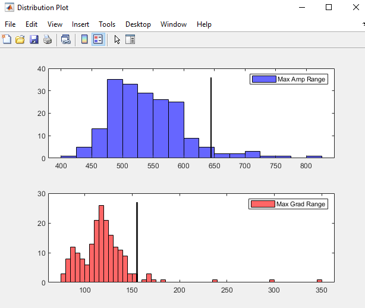

ArtifactScan Adjustment Decision
""""""""
Determine whether you'd like to return to the beginning and change channel exclusion method

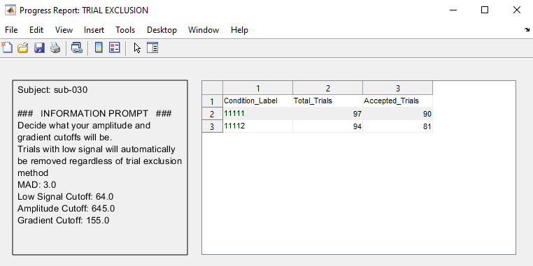

Save Results
""""""""
Determine whether you'd like to save results and move on to next subject

.. image:: ims/step024.PNG
.. image:: ims/step025.PNG

Warnings
""""""""
Potential warning if data blocks/trials are of different lengths

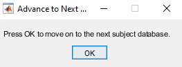

Log Compilation
""""""""
Now go ahead and compile all output logs

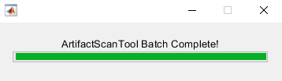
.. image:: ims/step028.PNG
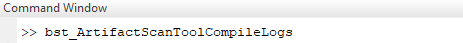
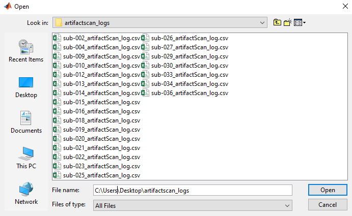
.. image:: ims/step031.PNG
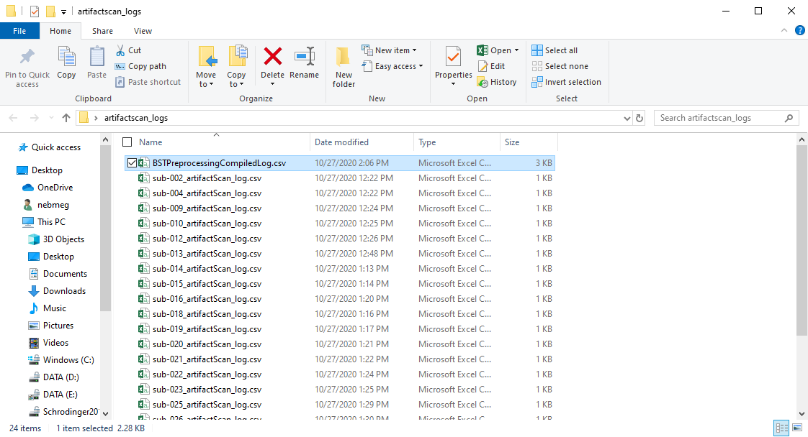

Support
-------

If you are having issues, please let us know.
Email Nick: nichrishayes | at | gmail | dot | com

License
-------

This software is distributed under the terms of the GNU General Public License as published by the Free Software Foundation. Further details on the GPLv3 license can be found at http://www.gnu.org/copyleft/gpl.html.

.. Indices and tables
.. ==================

.. * :ref:`genindex`
.. * :ref:`modindex`
.. * :ref:`search`
