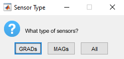
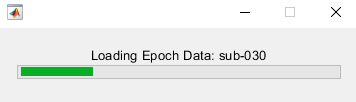
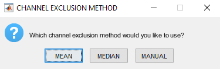
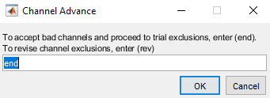
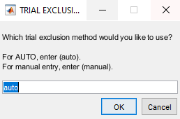
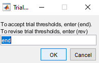
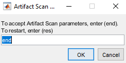
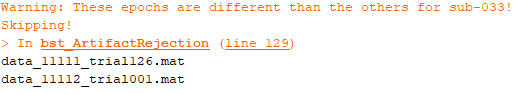
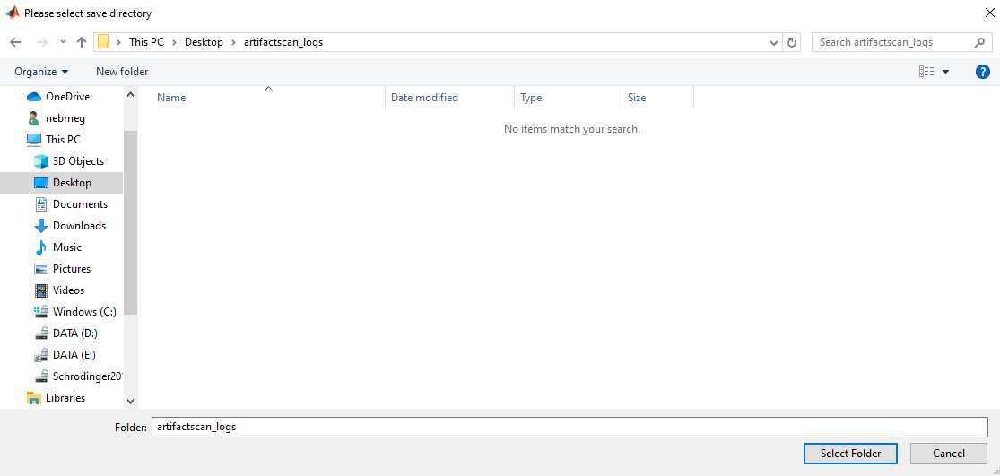

.. ArtifactScanTool documentation master file, created by
   sphinx-quickstart on Tue Oct 27 15:23:31 2020.
   You can adapt this file completely to your liking, but it should at least
   contain the root `toctree` directive.

Welcome to ArtifactScanTool's documentation!
=======================================================
.. toctree::
   :maxdepth: 3
   :caption: Contents:

Features
--------

- Complete Integration with `Brainstorm <https://neuroimage.usc.edu/brainstorm/Introduction/>`_
- Semi-automated exclusion of artifactual channels and epochs (i.e. trials or data blocks)
- Heatmap and histogram plotting
- Statical and Manual exclusions

Getting Started
--------------------

Call ArtifactScanTool (via ArtifactScanRejection)
"""""""""""""""""""""""""""""""""""""""""""""""""""
Call the tool from the Matlab command-line

Data Input
"""""""""""
Select the Brainstorm subject directories for review

Data Type
"""""""""""
Select the data type (typically "blocks" with resting state and "trials" for task-based data)

Sensor Type
"""""""""""""
Select the sensor type (designed with Elekta/MEGIN Mags Grads)

Log Output
""""""""""""
Select output log directory path

Artifact Calculation
""""""""""""""""""""
Data loading...  Artifact measures (amplitude and gradient) will be calculated...

Channel Exclusion Method
"""""""""""""""""""""""""""
Select a central tendency method to remove channels/sensors

Options

1. Mean

2. Median

3. Manual

Sensor Layout
"""""""""""""""
Gradiometer topoplot (with sensor labels, Elekta/MEGIN GRADS only)

Channel Exclusion Deviation Threshold
"""""""""""""""""""""""""""""""""""""""
Now enter a deviation cutoff to be applied. This will be standard deviation if "Mean" was selected, or median absolute deviation if "Median" was selected.

Channel Exlcusion Plotting
"""""""""""""""""""""""""""
Three figures will popup; one amplitude, one gradient, and one progress report

.. image:: ims/step013.PNG

.. image:: ims/step015.PNG

Amplitude and Gradient figures will each contain three subplots

1. Top subplot - fixed color thresholds, no bad channels marked

2. Middle subplot - color thresholds normalized to the active subject, no bad channels marked

3. Bottom subplot - color thresholds normalized to the activee subject, bad channels marked (with max colorbar color value)

Progress Report figure will contain

1. The subject identifier

2. Which channel exclusion method was selected

3. Deviation cutoff values

4. Bad channels (i.e. tag included for amplitude, low signal, gradient)

Note - channels with a low signal 10% or more of data blocks/trials will be automatically marked for removal

Channel Adjustment Decision
""""""""""""""""""""""""""""""
Determine whether you'd like to change channel exclusion method or adjust thresholds, or continue to trial exclusion

Trial Exclusion Method
"""""""""""""""""""""""
You will then be prompted to select a trial rejection method to remove data blocks/trials

Options

1. Auto

2. Manual

.. image:: ims/step017.PNG

Trial Exclusion Deviation Threshold
""""""""""""""""""""""""""""""""""""
Enter deviation value (MAD, trial exlcusion uses median for central tendency to best fit tails of distribution)

Trial Exclusion Plotting
""""""""""""""""""""""""
Four figures will popup; one amplitude, one gradient, and one progress report.

Amplitude and Gradient figures will each contain three subplots

1. Top subplot - fixed color thresholds, bad channels marked and no bad trials marked

2. Middle subplot - color thresholds normalized to the active subject, bad channels marked and no bad trials marked

3. Bottom subplot - color thresholds normalized to the activee subject, bad channels marked and bad trials marked (with max colorbar color value)

Trial distribution figure will contain

1. Histogram of amplitude values for each trial

2. Historgram of gradient values for each trial

Note - These values are estimated based on the matrix with bad channels removed (i.e. bad channel data are not included in these plots)

Progress Report figure will contain

1. The subject identifier

2. Deviation cutoff values

3. Amplitude and gradient threshold values

4. A table with specific counts (pre and post thresholding) for data blocks/trials. If there are multiple conditions, all will be listed

Trial Adjustment Decision & ArtifactScan Adjustment Decision
""""""""""""""""""""""""""""""""""""""""""""""""""""""""""""""""""
Determine whether you'd like to change trial exclusion method or adjust thresholds

Determine whether you'd like to return to the beginning and change channel exclusion method

Save Results
"""""""""""""
Save and proceed to next subject

Warnings
""""""""""
Potential warning if data blocks/trials are of different lengths

Log Compilation
"""""""""""""""""
Now go ahead and compile all output logs

.. image:: ims/step029.PNG

Support
-------

If you are having issues, please let us know.
Email Nick: nichrishayes | at | gmail | dot | com

License
-------

This software is distributed under the terms of the GNU General Public License as published by the Free Software Foundation. Further details on the GPLv3 license can be found at http://www.gnu.org/copyleft/gpl.html.

.. Indices and tables
.. ==================

.. * :ref:`genindex`
.. * :ref:`modindex`
.. * :ref:`search`
